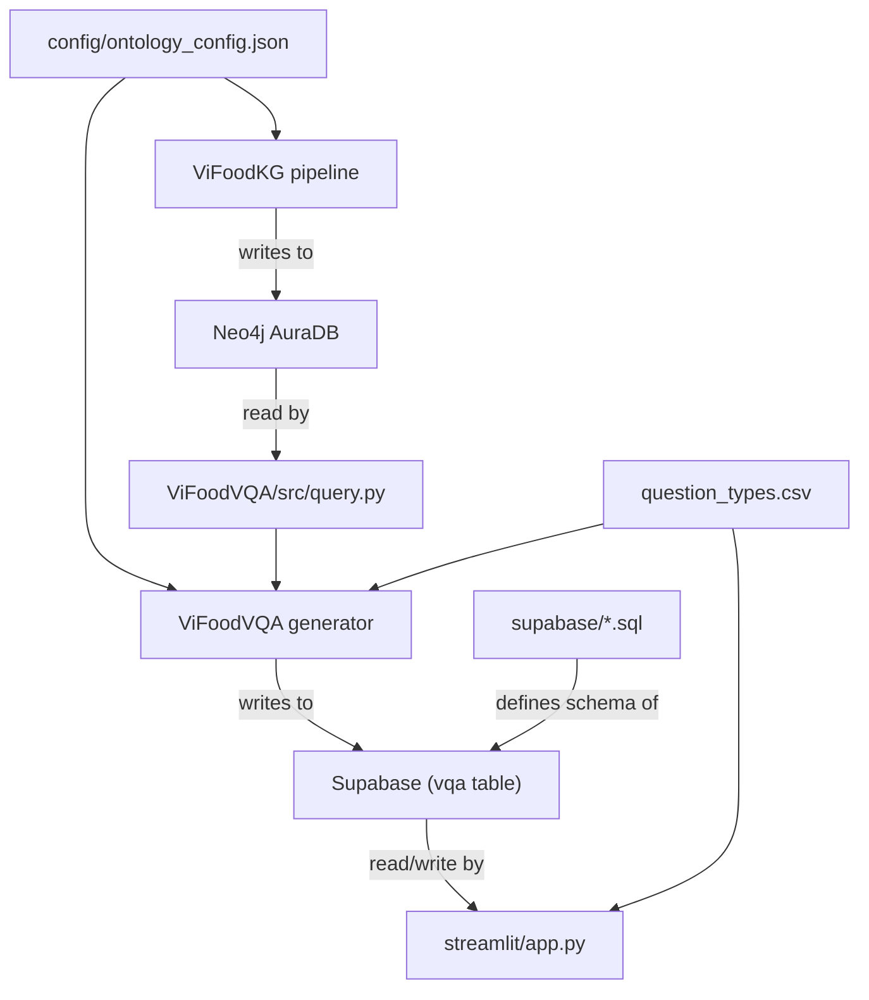
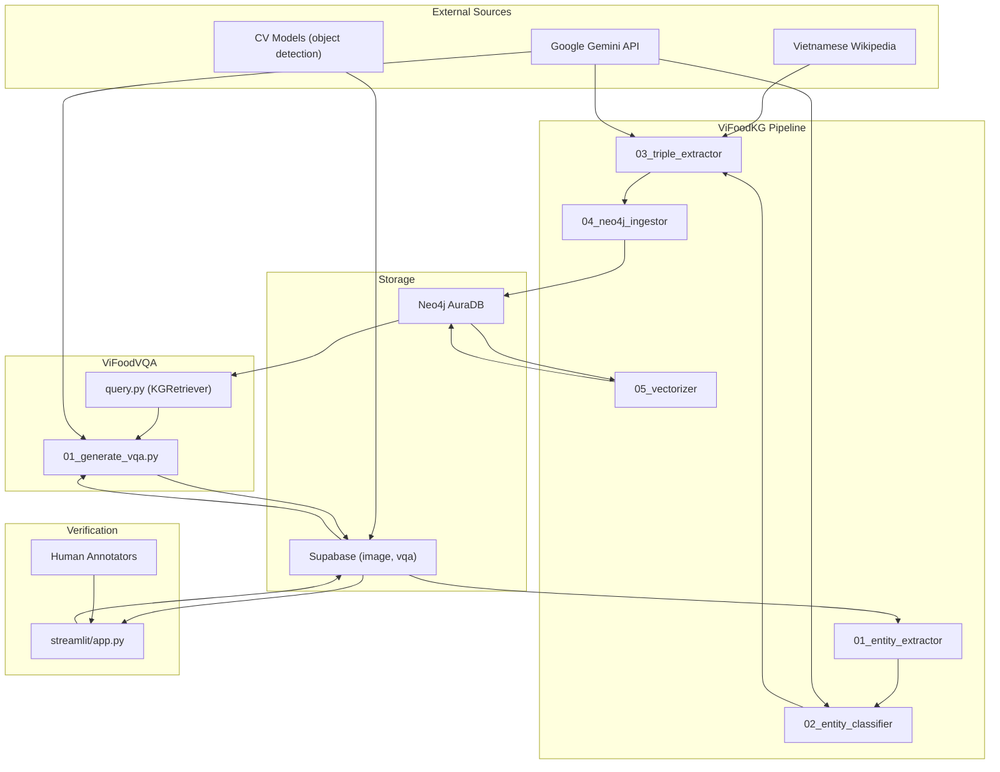

# ViFoodKG — System Architecture

> **Canonical source** for architecture decisions, module boundaries, and artifact flow.
> Last updated: 2026-04-15.

## System Purpose

ViFoodKG builds and operates a knowledge-grounded Vietnamese food VQA pipeline:

1. **Construct** a Knowledge Graph from web + LLM sources
2. **Store** it in Neo4j with vector-indexed edges for hybrid retrieval
3. **Generate** multiple-choice VQA samples grounded in KG triples
4. **Verify** VQA quality through a human annotation workflow

## Module Boundaries

```
┌─────────────────────────────────────────────────────────────────────────┐
│                         ViFoodKG Repository                            │
├──────────────────┬──────────────────┬──────────────────┬───────────────┤
│   ViFoodKG/      │   ViFoodVQA/     │   streamlit/     │   config/     │
│                  │                  │                  │   supabase/   │
│  KG Pipeline     │  VQA Generation  │  Annotation UI   │  Shared       │
│  (offline batch) │  (offline batch) │  (live service)  │  Config       │
├──────────────────┼──────────────────┼──────────────────┼───────────────┤
│  Neo4j (write)   │  Neo4j (read)    │  Supabase (r/w)  │               │
│  Supabase (read) │  Supabase (read) │                  │               │
│  Gemini (call)   │  Gemini (call)   │                  │               │
│  S-Transformers  │  S-Transformers  │                  │               │
└──────────────────┴──────────────────┴──────────────────┴───────────────┘
```

### Responsibilities

| Module | Is responsible for | Is NOT responsible for |
|--------|--------------------|----------------------|
| **ViFoodKG** | Entity extraction, classification, triple extraction, Neo4j ingestion, edge vectorization | VQA generation, annotation UI |
| **ViFoodVQA** | KG retrieval (`query.py`), VQA sample generation, candidate construction, Gemini prompting | KG construction, annotation |
| **streamlit** | Human annotation, VQA verification (KEEP/DROP), triple inline editing, audit logging | KG construction, VQA generation |
| **config** | Ontology schema, question type definitions | Runtime logic |
| **supabase** | Database schema migrations | Application logic |

### Module Dependencies



## Pipeline Stages

### Stage 1: Entity Extraction

| | |
|---|---|
| **Script** | `ViFoodKG/src/01_kg_entity_extractor.py` |
| **Input** | Supabase `image` table (food labels from CV models) |
| **Output** | `data/raw_unique_labels.json` |
| **External deps** | Supabase API |

Queries the `image` table for `food_items` arrays, deduplicates, and outputs a flat list of unique food labels.

### Stage 2: Entity Classification

| | |
|---|---|
| **Script** | `ViFoodKG/src/02_kg_entity_classifier.py` |
| **Input** | `data/raw_unique_labels.json` |
| **Output** | `data/master_entities.json` |
| **External deps** | Gemini API |

Uses Gemini to clean noisy labels (e.g., `"bun_bo"` → `"Bún Bò Huế"`) and classify into ontology categories (MainDish, Ingredient, Region, etc.).

### Stage 3: Triple Extraction

| | |
|---|---|
| **Script** | `ViFoodKG/src/03_kg_triple_extractor.py` |
| **Input** | `data/master_entities.json`, `config/ontology_config.json` |
| **Output** | `data/triples/*.json` (one file per entity) |
| **External deps** | Wikipedia API, Gemini API |

Two-layer extraction:
1. **Web-grounded:** Crawl Vietnamese Wikipedia, send to Gemini for structured triple extraction
2. **LLM reasoning:** If web data is insufficient, use Gemini's internal culinary knowledge (marked as `source_url: "LLM_Knowledge"`)

Each triple includes: `subject`, `relation`, `target`, `evidence`, `source_url`, `confidence`.

### Stage 4: Neo4j Ingestion

| | |
|---|---|
| **Script** | `ViFoodKG/src/04_kg_neo4j_ingestor.py` |
| **Input** | `data/triples/*.json` |
| **Output** | Neo4j graph (nodes + relationships) |
| **External deps** | Neo4j AuraDB |

Parses triple JSON and creates Neo4j nodes + relationships using `MERGE` for idempotency. Handles **reification** for `SubstitutionRule` (3-node pattern: `Dish → SubstitutionRule → Ingredient`). Adds `verbalized_text` property to edges for downstream vectorization.

### Stage 5: Vectorization

| | |
|---|---|
| **Script** | `ViFoodKG/src/05_kg_vectorizer.py` |
| **Input** | Neo4j graph edges with `verbalized_text` |
| **Output** | `embedding` property on edges + Neo4j vector index |
| **External deps** | Neo4j AuraDB, `intfloat/multilingual-e5-small` |

Encodes `verbalized_text` of each edge into a 384-dim vector using `multilingual-e5-small`. Creates a cosine similarity vector index on Neo4j. Covers all 12 relationship types.

> **Note:** The config defines 10 entity classes. `Condiment` and `SubstitutionRule` are additional node labels created by the ingestor at runtime.

### Stage 6: VQA Generation

| | |
|---|---|
| **Script** | `ViFoodVQA/src/01_generate_vqa.py` |
| **Retriever** | `ViFoodVQA/src/query.py` (`KGRetriever` class) |
| **Input** | Supabase `image` table, Neo4j KG, `question_types.csv` |
| **Output** | `data/vqa/generated_vqa.json`, Supabase `vqa` table |
| **External deps** | Neo4j, Supabase, Gemini API, `multilingual-e5-small` |

For each approved image:
1. Match `food_items` to KG `Dish` nodes (anchor)
2. Traverse local 1-hop and 2-hop subgraph
3. Prefilter relations by question type
4. Rank by cosine similarity on **full path text** (not edge embedding)
5. Build candidate answer + 3 distractors from KG
6. Prompt Gemini to generate question + rationale in Vietnamese

### Stage 7: Human Verification

| | |
|---|---|
| **App** | `streamlit/app.py` |
| **Input** | Supabase `vqa` + `image` + `kg_triple_catalog` tables |
| **Output** | Updated verification scores, KEEP/DROP decisions, triple edits |
| **Deployment** | Streamlit Cloud / GitHub Codespaces |

See `docs/VERIFY_VQA_GUIDELINE.md` for the full rubric.

## Retrieval Strategy (Neo → Traverse → Prefilter → Rank)

The retrieval strategy in `ViFoodVQA/src/query.py` is the core of the VQA pipeline:

```
1. Neo       → Anchor into Dish nodes matching food_items from the image
2. Traverse  → Get 1-hop and 2-hop neighborhood via Cypher
3. Prefilter → Keep only relations matching the current question type
4. Rank      → Embed full path text at runtime, cosine vs. query intent
```

**Key design decisions:**
- Ranking uses **full path text** (e.g., `"Phở bò có thành phần thịt bò; thịt bò có chất gây dị ứng Gluten"`) rather than individual edge embeddings. This ensures 2-hop paths are scored fairly.
- The `allowed_relations` parameter enables **prefiltering by question type** before top-k selection, preventing popular 1-hop relations from crowding out rarer 2-hop paths.
- Embedding model: `intfloat/multilingual-e5-small` (384-dim, multilingual).

See `docs/retrieve_logic_changes_report.md` for the full rationale.

## Runtime Boundaries

| Boundary | Technology | Notes |
|----------|-----------|-------|
| Graph database | Neo4j AuraDB (cloud) | KG pipeline writes, retriever reads |
| Relational database | Supabase (PostgreSQL) | Image metadata, VQA data, annotation state |
| LLM | Google Gemini API | Used by stages 2, 3, 6 |
| Embedding model | `intfloat/multilingual-e5-small` | Used by stages 5, 6 (vectorizer + retriever) |
| Annotation UI | Streamlit (Python) | Deployed on Streamlit Cloud or Codespaces |
| Batch processing | Local / Kaggle / Google Colab | KG pipeline and VQA generation |

## Data Flow Diagram



## Current Limitations

1. **No CI/CD** — No automated testing or deployment pipeline.
2. **Duplicated config** — `question_types.csv` exists in 3 locations; must be kept in sync manually.
3. **No automated schema validation** — The triple JSON schema is enforced only by convention (see `docs/contracts/triple_schema.md`).
4. **Single embedding model** — The system is coupled to `multilingual-e5-small`. Switching models requires re-vectorizing all edges and clearing the embedding cache.
5. **Vietnamese Wikipedia coverage** — Many dishes have minimal Wikipedia articles, requiring heavy reliance on LLM reasoning (≈60% of triples are `LLM_Knowledge` sourced).

## Current Scale

| Metric | Value | Source |
|--------|------:|--------|
| KG Nodes | 3,382 | Neo4j live, 2026-04-28 |
| KG Edges (triples) | 9,765 | Neo4j live, 2026-04-28 |
| KG entity labels | 27 | Neo4j live, 2026-04-28 |
| KG relationship types | 12 | Neo4j live, 2026-04-28 |
| VQA Q&A pairs | 8,910 | Supabase live split-aware policy, 2026-04-28 |
| Images | 1,426 | Supabase live `image.is_checked=true` and `image.is_drop=false`, 2026-04-28 |

> Source: `ViFoodVQA/ViFoodVQA/src/scripts/collect_ground_truth_stats.py`.
> Older slide/report numbers are historical snapshots; see
> `../../docs/ground_truth_metrics.md` for the current count policy.

## Change Impact Notes

| If you change... | Then also check/update... |
|-----------------|--------------------------|
| Ontology entity/relation names | `ontology_config.json`, `03_triple_extractor.py`, `04_neo4j_ingestor.py`, `05_vectorizer.py`, `query.py` (`_RELATION_TO_VI`), `01_generate_vqa.py` (`select_candidates()`) |
| Triple JSON schema | `docs/contracts/triple_schema.md`, `app.py` (`canonicalize_triple()`), `01_generate_vqa.py` (`shrink_triples()`) |
| Supabase table columns | `supabase/*.sql`, `app.py` (`column_exists()` calls), `01_generate_vqa.py` (`fetch_image_rows()`) |
| Cypher traverse query | `query.py` (`_TRAVERSE_QUERY`), test with CLI: `python query.py -i "Phở Bò" -q "test" -k 5` |
| Embedding model | `query.py` (`MODEL_NAME`), `05_kg_vectorizer.py`, re-run full vectorization |
| Question types CSV | All 3 copies, `01_generate_vqa.py` (`load_question_types()`), `app.py` (reads `QUESTION_TYPES_CSV` via `csv.DictReader`) |

## See Also

- [AGENTS.md](../AGENTS.md) — coding agent guide
- [docs/contracts/triple_schema.md](contracts/triple_schema.md) — triple JSON contract
- [docs/contracts/ontology_config.md](contracts/ontology_config.md) — ontology governance
- [docs/VERIFY_VQA_GUIDELINE.md](VERIFY_VQA_GUIDELINE.md) — VQA verification rubric
